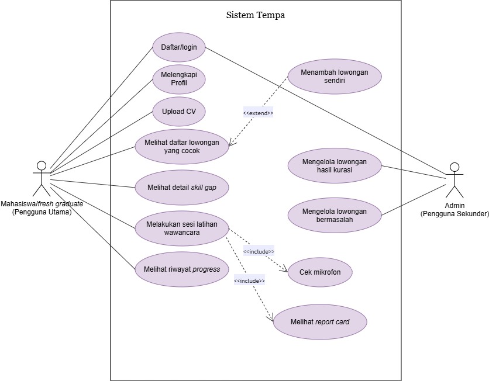
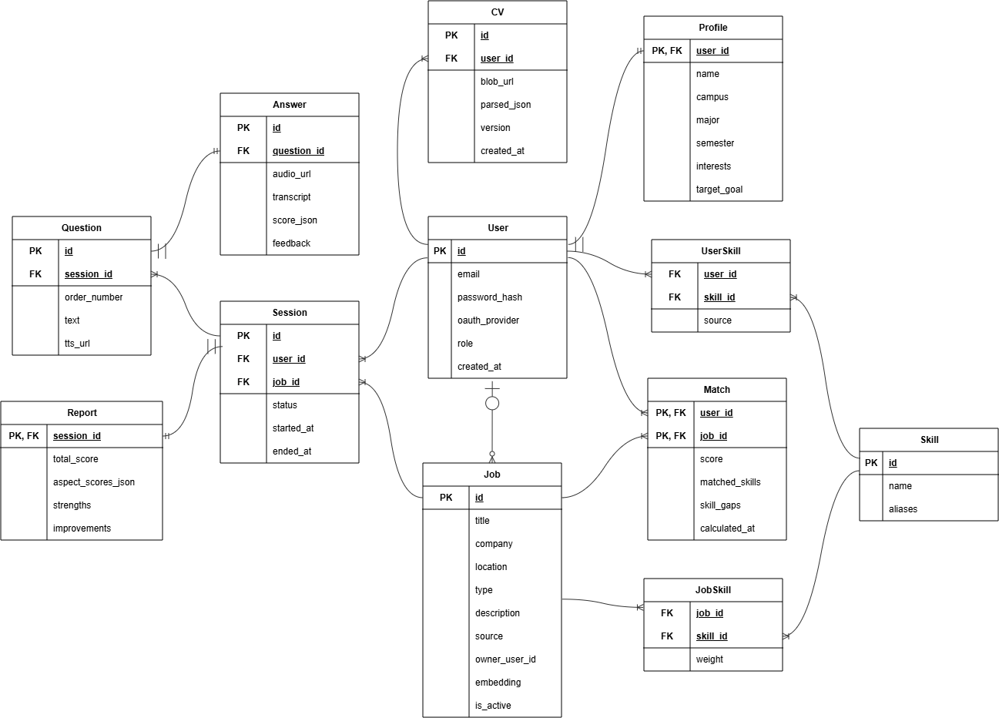
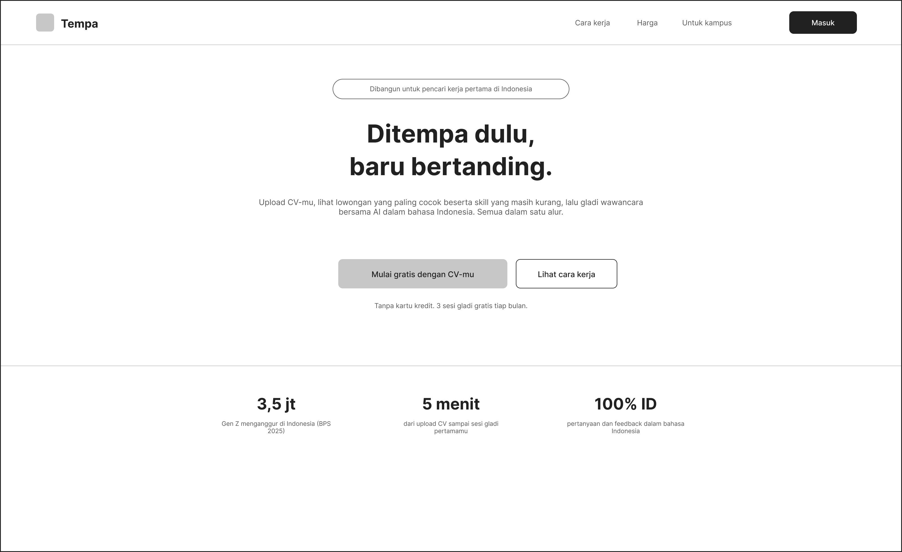
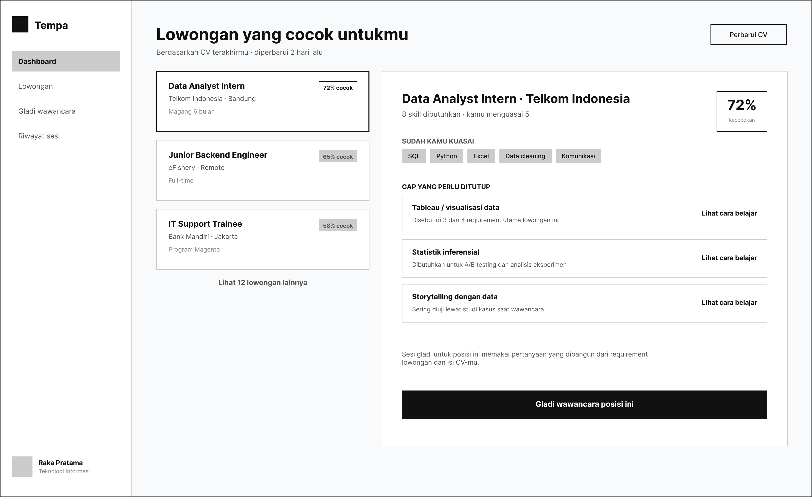

# Project Senior Project TI

**Instansi:** Departemen Teknologi Elektro dan Teknologi Informasi, Fakultas Teknik, Universitas Gadjah Mada  
**Nama Kelompok:** Claude Final Boss

---

## Anggota Kelompok

| Nama                                    | NIM                | Peran                             |
| :-------------------------------------- | :----------------- | :-------------------------------- |
| **Axel Urwawuska Atarubby**             | 24/545465/TK/60670 | Software Engineer, Cloud Engineer |
| **Muhammad Nabil Fitriansyah Boernama** | 24/545232/TK/60628 | Project Manager, AI Engineer      |
| **Yuki Shafa Maheswari**                | 24/545600/TK/60708 | UI/UX Designer                    |

---

## 1. Informasi Produk

- **Nama Produk:** Tempa
- **Jenis Produk:** Aplikasi Web Persiapan Karier Berbasis AI (_AI Career Preparation Web App_)

---

## 2. Latar Belakang & Permasalahan

### Latar Belakang

BPS mencatat sekitar 3,5 juta pengangguran dari kalangan Gen Z pada 2025, kelompok usia yang baru memasuki pasar kerja. Permasalahan ini diperparah oleh kesenjangan antara kualifikasi pencari kerja dan kebutuhan industri: riset Populix dan KitaLulus (2024) menemukan 46% perusahaan di Indonesia kesulitan menemukan kandidat yang sesuai, dengan 50% perusahaan menilai kemampuan teknis pelamar masih di level pemula dan 35% menganggap soft skill pelamar belum memadai. Persaingan seleksi kerja dan magang sangat ketat, sementara mahasiswa umumnya tidak tahu kesenjangan skill mereka terhadap kebutuhan lowongan dan tidak pernah berlatih wawancara secara terstruktur karena layanan persiapan karier mahal dan didominasi bahasa Inggris.

### Rumusan Masalah

1. Bagaimana membantu mahasiswa mengetahui kesenjangan skill mereka terhadap kebutuhan lowongan magang atau kerja secara objektif?
2. Bagaimana menyediakan sarana latihan wawancara yang realistis, terjangkau, dan berbahasa Indonesia?
3. Bagaimana mengukur dan meningkatkan kesiapan magang mahasiswa dari waktu ke waktu?

### Daftar Pustaka

- CNBC Indonesia (2025), _"Pengangguran RI Mayoritas Gen Z, Jumlahnya 3,5 Juta Orang"_, data BPS: [https://www.cnbcindonesia.com/news/20250718070931-4-650112/pengangguran-ri-mayoritas-gen-z-jumlahnya-35-juta-orang](https://www.cnbcindonesia.com/news/20250718070931-4-650112/pengangguran-ri-mayoritas-gen-z-jumlahnya-35-juta-orang)
- ANTARA News (2024), _"Qualification, skills mismatch ailing job market, says study"_, riset Populix & KitaLulus: [https://en.antaranews.com/news/323543/qualification-skills-mismatch-ailing-job-market-says-study](https://en.antaranews.com/news/323543/qualification-skills-mismatch-ailing-job-market-says-study)

---

## 3. Ide Solusi & Rancangan Fitur

### Deskripsi Solusi

**Tempa** adalah aplikasi web persiapan karier yang menggabungkan pencocokan lowongan, analisis _skill gap_, dan simulasi wawancara berbasis suara dengan AI dalam satu alur terpadu: upload CV, masukkan URL atau deskripsi lowongan (atau temukan pada daftar yang tersedia), lihat analisis gap, lalu gladi wawancara untuk posisi yang dituju.

### Rancangan Fitur Solusi

| Fitur                                | Keterangan                                                                                                                                                                                                                                   |
| :----------------------------------- | :------------------------------------------------------------------------------------------------------------------------------------------------------------------------------------------------------------------------------------------- |
| **CV Parsing**                       | Pengguna mengunggah CV (PDF), AI secara otomatis mengekstrak informasi skill, pengalaman, dan pendidikan.                                                                                                                                    |
| **Input Lowongan (User)**            | Pengguna menempelkan URL atau teks deskripsi lowongan yang diincar. LLM mem-parsing _requirements_ (skill, kualifikasi, pengalaman). Jika input minim, LLM menghasilkan asumsi dan meminta konfirmasi pengguna. _(Fitur prioritas)_          |
| **Rekomendasi Lowongan (Developer)** | Basis data lowongan yang diperbarui berkala oleh tim developer. Pengguna dapat menelusuri (_browse_) lowongan yang tersedia sebagai alternatif input mandiri. _(Fitur tambahan setelah alur input mandiri berjalan)_                         |
| **Skill Gap Report**                 | Perbandingan terperinci antara keahlian pengguna vs kebutuhan lowongan, dilengkapi rekomendasi terstruktur untuk menutup _gap_.                                                                                                              |
| **Mock Interview Suara**             | Pertanyaan digenerasi kontekstual berdasarkan lowongan dan CV, dibacakan menggunakan Text-to-Speech (id-ID). Pengguna menjawab secara lisan, direkam dan ditranskrip menggunakan Speech-to-Text, serta dinilai oleh LLM secara _turn-based_. |
| **Report Card**                      | Penilaian skor per pertanyaan, umpan balik konstruktif, serta pelacakan perkembangan (_progress tracking_) antar sesi latihan.                                                                                                               |

---

## 4. Analisis Kompetitor

### Kompetitor 1: Final Round AI

- **Jenis Kompetitor:** Direct Competitor
- **Jenis Produk:** Aplikasi web AI interview prep
- **Target Customer:** Job seeker global, terutama pasar Amerika Serikat
- **Kelebihan:** Fitur lengkap (_mock interview real-time_, copilot) dan model AI matang
- **Kekurangan:** Hanya mendukung Bahasa Inggris, biaya langganan mahal bagi mahasiswa Indonesia, dan tidak memahami konteks seleksi lokal (BUMN/CPNS)
- **Key Competitive Advantage & Unique Value Tempa:** Berbahasa Indonesia, harga terjangkau bagi mahasiswa, serta disesuaikan dengan konteks seleksi kerja lokal Indonesia.

### Kompetitor 2: Google Interview Warmup

- **Jenis Kompetitor:** Direct Competitor
- **Jenis Produk:** Web app latihan interview gratis
- **Target Customer:** Pencari kerja umum, fokus program sertifikat Google
- **Kelebihan:** Gratis, antarmuka ringan, serta didukung reputasi brand besar
- **Kekurangan:** Pertanyaan bersifat generik (tidak disesuaikan dengan lowongan kerja nyata), tidak memiliki fitur _job matching_ maupun analisis _skill gap_, dan hanya berbahasa Inggris
- **Key Competitive Advantage & Unique Value Tempa:** Pertanyaan sangat kontekstual berdasarkan lowongan spesifik serta alur menyeluruh mulai dari analisis _gap_ hingga latihan wawancara dalam satu platform.

### Kompetitor 3: Glints

- **Jenis Kompetitor:** Indirect Competitor
- **Jenis Produk:** Job portal & komunitas karier
- **Target Customer:** Talenta muda Asia Tenggara
- **Kelebihan:** Basis data lowongan kerja sangat besar dan memiliki brand kuat di kalangan _fresh graduate_
- **Kekurangan:** Tidak menyediakan analisis _skill gap_ secara eksplisit dan tidak memiliki sarana simulasi/latihan wawancara
- **Key Competitive Advantage & Unique Value Tempa:** Tidak hanya berfungsi mencari lowongan, tetapi mendampingi dan mempersiapkan pengguna secara komprehensif agar benar-benar siap dan lolos seleksi kerja.

---

## 5. Perancangan SDLC Produk

### a. Tujuan dari Produk

Menempa mahasiswa dan/atau fresh graduate di Indonesia agar siap menghadapi seleksi
magang/kerja, dengan mengidentifikasi kesenjangan skill mereka terhadap lowongan
spesifik dan memberi mereka ruang berlatih wawancara berbasis suara dengan AI, tanpa
biaya mahal dan dalam bahasa Indonesia.

### b. Pengguna Potensial & Kebutuhan Pengguna

Pengguna potensial utamanya adalah mahasiswa tingkat akhir dan fresh graduate (0-2
tahun) di Indonesia yang sedang bersiap untuk mendaftar kerja/magang, sedangkan
pengguna sekundernya adalah admin/kurator tim untuk mengelola database lowongan.

Untuk pengguna utama, kebutuhannya adalah:
- Mengetahui skill gap mereka terhadap kebutuhan lowongan secara objektif
- Sarana latihan wawancara yang realistis dan terjangkau serta memberikan feedback yang terstruktur
- Cara memasukkan lowongan yang mereka temukan sendiri agar tetap bisa dianalisis

Untuk pengguna sekunder, kebutuhannya adalah alat untuk mengelola dan menjaga
kualitas database lowongan agar matching tetap relevan.

### c. Use Case Diagram

### d. Functional Requirements

| FR | Deskripsi |
| :--- | :--- |
| FR-1 | Pengguna dapat mendaftar dan login menggunakan email/password (dihashing) atau Google OAuth, serta tetap dalam sesi login menggunakan token JWT. |
| FR-2 | Pengguna mengisi profil (nama, kampus, jurusan, semester, minat karier, target 6 bulan) yang akan dipakai sebagai konteks untuk matching lowongan dan referensi pertanyaan wawancara. |
| FR-3 | Pengguna mengunggah CV dalam format PDF, lalu sistem mengekstrak skill, pengalaman, dan pendidikan menggunakan LLM; pengguna dapat mengoreksi hasil ekstraksi sebelum disimpan. |
| FR-4 | Sistem menghitung skor kecocokan antara CV pengguna dan tiap lowongan (kombinasi embedding similarity dan overlap skill), lalu menampilkan skill yang sudah dikuasai, skill gap, dan rekomendasi cara menutup gap tersebut. |
| FR-5 | Pengguna dapat menambahkan lowongan yang ditemukan secara mandiri (via tautan atau teks) untuk diekstrak dan diikutkan dalam perhitungan matching. |
| FR-6 | Pengguna menjalani sesi latihan wawancara suara (turn-based) sebanyak 8 pertanyaan per lowongan; pertanyaan dibacakan lewat Text-To-Speech (TTS), jawaban direkam dan ditranskrip lewat Speech-To-Text (STT) untuk kemudian dinilai. |
| FR-7 | Sistem menilai tiap jawaban wawancara berdasarkan rubrik 5 aspek dan menghasilkan report card berisi skor keseluruhan, feedback per pertanyaan, kekuatan, dan fokus perbaikan. |
| FR-8 | Sistem menyimpan riwayat sesi latihan per pengguna dan menampilkan perkembangan skor antar sesi untuk posisi yang sama. |
| FR-9 | Admin dapat menambah, mengedit, atau menonaktifkan lowongan kurasi, serta meninjau lowongan input pengguna yang dilaporkan bermasalah. |

### e. Entity Relationship Diagram

### f. Low-Fidelity Wireframe

### g. Gantt Chart Pengerjaan Proyek (12 Minggu)

| Kegiatan | 1 | 2 | 3 | 4 | 5 | 6 | 7 | 8 | 9 | 10 | 11 | 12 |
| :--- | :-: | :-: | :-: | :-: | :-: | :-: | :-: | :-: | :-: | :-: | :-: | :-: |
| Brainstorming & riset | X | X | | | | | | | | | | |
| PRD, Lean Canvas, kompetitor | | X | X | | | | | | | | | |
| Use case dan arsitektur | | X | X | X | | | | | | | | |
| Wireframe & prototype | | | X | X | X | | | | | | | |
| Repo, CI/CD, skeleton Azure (M1) | | | X | X | X | | | | | | | |
| Auth + onboarding + profil | | | | | X | X | | | | | | |
| Upload CV + parsing LLM (M2) | | | | | | X | X | | | | | |
| Job matching + skill gap | | | | | | | X | X | | | | |
| Input lowongan mandiri (M3) | | | | | | | | X | X | | | |
| Latihan wawancara TTS/STT | | | | | | | | X | X | X | | |
| Report card + tracking (M4) | | | | | | | | | | X | X | |
| Panel kurasi, hardening, docs | | | | | | | | | | X | X | X |
| UAT 10 mhs + gladi demo (M5) | | | | | | | | | | | X | X |

---
